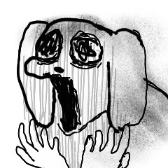
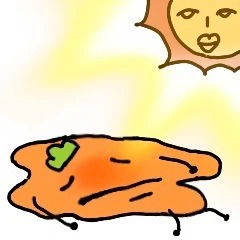
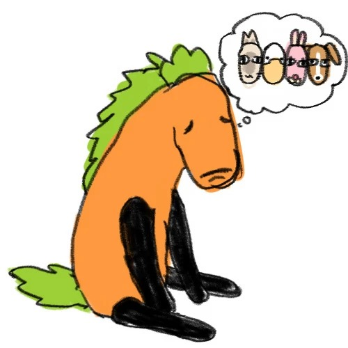
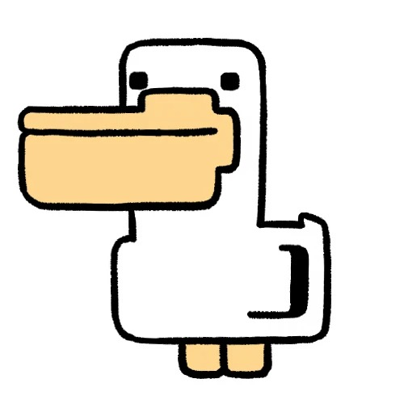
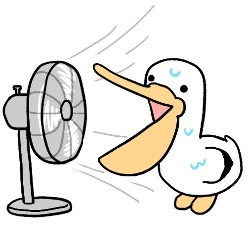

# 🎭 Avatars & Stickers Gallery

个人自用表情包 / 角色头像外链图库（暹罗厘普系列共 100 张）。用于酒馆 (SillyTavern) 角色卡、各种 Bot 匿名头像、论坛及日常聊天。

## 🔗 外链地址格式

替换末尾的 `<文件名>` 为下表对应的图片名即可（如 `dog-01.jpg`）：

* **GitHub Raw (原始直链)**:
  ```text
  https://raw.githubusercontent.com/wilderye/avatars/main/<文件名>
  ```
* **jsDelivr CDN (国内高速免翻墙推荐)**:
  ```text
  https://cdn.jsdelivr.net/gh/wilderye/avatars@main/<文件名>
  ```

---

## 🖼️ 图片画廊

### 🌸 小花仙子 (`flower`) - 5 张

| 预览 | 预览 | 预览 | 预览 |
| :---: | :---: | :---: | :---: |
| <br><code>flower-01.jpg</code> | <br><code>flower-02.jpg</code> | <br><code>flower-03.jpg</code> | <br><code>flower-04.jpg</code> |
| <br><code>flower-05.jpg</code> |   |   |   |


### 🎄 圣诞佳节 (`xmas`) - 5 张

| 预览 | 预览 | 预览 | 预览 |
| :---: | :---: | :---: | :---: |
| <br><code>xmas-01.jpg</code> | <br><code>xmas-02.jpg</code> | <br><code>xmas-03.jpg</code> | <br><code>xmas-04.jpg</code> |
| <br><code>xmas-05.jpg</code> |   |   |   |


### 👑 帝王睡相 (`sleep`) - 6 张

| 预览 | 预览 | 预览 | 预览 |
| :---: | :---: | :---: | :---: |
| <br><code>sleep-01.jpg</code> | <br><code>sleep-02.jpg</code> | <br><code>sleep-03.jpg</code> | <br><code>sleep-04.jpg</code> |
| <br><code>sleep-05.jpg</code> | <br><code>sleep-06.jpg</code> |   |   |


### 🎁 给你的 (`foryou`) - 7 张

| 预览 | 预览 | 预览 | 预览 |
| :---: | :---: | :---: | :---: |
| <br><code>foryou-01.jpg</code> | <br><code>foryou-02.jpg</code> | <br><code>foryou-03.jpg</code> | <br><code>foryou-04.jpg</code> |
| <br><code>foryou-05.jpg</code> | <br><code>foryou-06.jpg</code> | <br><code>foryou-07.jpg</code> |   |


### 🐶 可爱小狗 (`dog`) - 15 张

| 预览 | 预览 | 预览 | 预览 |
| :---: | :---: | :---: | :---: |
| <br><code>dog-01.jpg</code> | <br><code>dog-02.jpg</code> | <br><code>dog-03.jpg</code> | <br><code>dog-04.jpg</code> |
| <br><code>dog-05.jpg</code> | <br><code>dog-06.jpg</code> | <br><code>dog-07.jpg</code> | <br><code>dog-08.jpg</code> |
| <br><code>dog-09.jpg</code> | <br><code>dog-10.jpg</code> | <br><code>dog-11.jpg</code> | <br><code>dog-12.jpg</code> |
| <br><code>dog-13.jpg</code> | <br><code>dog-14.jpg</code> | <br><code>dog-15.jpg</code> |   |


### 🔥 很热 (`hot`) - 5 张

| 预览 | 预览 | 预览 | 预览 |
| :---: | :---: | :---: | :---: |
| <br><code>hot-01.jpg</code> | <br><code>hot-02.jpg</code> | <br><code>hot-03.jpg</code> | <br><code>hot-04.jpg</code> |
| <br><code>hot-05.jpg</code> |   |   |   |


### 🌧️ 老天爷别下了 (`rain`) - 5 张

| 预览 | 预览 | 预览 | 预览 |
| :---: | :---: | :---: | :---: |
| <br><code>rain-01.jpg</code> | <br><code>rain-02.jpg</code> | <br><code>rain-03.jpg</code> | <br><code>rain-04.jpg</code> |
| <br><code>rain-05.jpg</code> |   |   |   |


### 🍱 朋友带饭不敢吃 (`food`) - 1 张

| 预览 | 预览 | 预览 | 预览 |
| :---: | :---: | :---: | :---: |
| <br><code>food-01.jpg</code> |   |   |   |


### 👵 七个老姨算一难 (`aunt`) - 4 张

| 预览 | 预览 | 预览 | 预览 |
| :---: | :---: | :---: | :---: |
| <br><code>aunt-01.jpg</code> | <br><code>aunt-02.jpg</code> | <br><code>aunt-03.jpg</code> | <br><code>aunt-04.jpg</code> |


### 🕶️ 前途阴暗好凉快 (`cool`) - 5 张

| 预览 | 预览 | 预览 | 预览 |
| :---: | :---: | :---: | :---: |
| <br><code>cool-01.jpg</code> | <br><code>cool-02.jpg</code> | <br><code>cool-03.jpg</code> | <br><code>cool-04.jpg</code> |
| <br><code>cool-05.jpg</code> |   |   |   |


### 🙏 请原谅 (`sorry`) - 6 张

| 预览 | 预览 | 预览 | 预览 |
| :---: | :---: | :---: | :---: |
| <br><code>sorry-01.jpg</code> | <br><code>sorry-02.jpg</code> | <br><code>sorry-03.jpg</code> | <br><code>sorry-04.jpg</code> |
| <br><code>sorry-05.jpg</code> | <br><code>sorry-06.jpg</code> |   |   |


### 📐 棱角分明 (`cube`) - 5 张

| 预览 | 预览 | 预览 | 预览 |
| :---: | :---: | :---: | :---: |
| <br><code>cube-01.jpg</code> | <br><code>cube-02.jpg</code> | <br><code>cube-03.jpg</code> | <br><code>cube-04.jpg</code> |
| <br><code>cube-05.jpg</code> |   |   |   |


### 🐱 暹罗厘普精选 (`xllp`) - 11 张

| 预览 | 预览 | 预览 | 预览 |
| :---: | :---: | :---: | :---: |
| <br><code>xllp-01.jpg</code> | <br><code>xllp-02.jpg</code> | <br><code>xllp-03.jpg</code> | <br><code>xllp-04.jpg</code> |
| <br><code>xllp-05.jpg</code> | <br><code>xllp-06.jpg</code> | <br><code>xllp-07.jpg</code> | <br><code>xllp-08.jpg</code> |
| <br><code>xllp-09.jpg</code> | <br><code>xllp-10.jpg</code> | <br><code>xllp-11.jpg</code> |   |


### 👀 我全都知道了 (`know`) - 7 张

| 预览 | 预览 | 预览 | 预览 |
| :---: | :---: | :---: | :---: |
| <br><code>know-01.jpg</code> | <br><code>know-02.jpg</code> | <br><code>know-03.jpg</code> | <br><code>know-04.jpg</code> |
| <br><code>know-05.jpg</code> | <br><code>know-06.jpg</code> | <br><code>know-07.jpg</code> |   |


### ❓ 谁在用这样的表情 (`who`) - 10 张

| 预览 | 预览 | 预览 | 预览 |
| :---: | :---: | :---: | :---: |
| <br><code>who-01.jpg</code> | <br><code>who-02.jpg</code> | <br><code>who-03.jpg</code> | <br><code>who-04.jpg</code> |
| <br><code>who-05.jpg</code> | <br><code>who-06.jpg</code> | <br><code>who-07.jpg</code> | <br><code>who-08.jpg</code> |
| <br><code>who-09.jpg</code> | <br><code>who-10.jpg</code> |   |   |


### 🧊 解暑招数 (`summer`) - 3 张

| 预览 | 预览 | 预览 | 预览 |
| :---: | :---: | :---: | :---: |
| <br><code>summer-01.jpg</code> | <br><code>summer-02.jpg</code> | <br><code>summer-03.jpg</code> |   |

